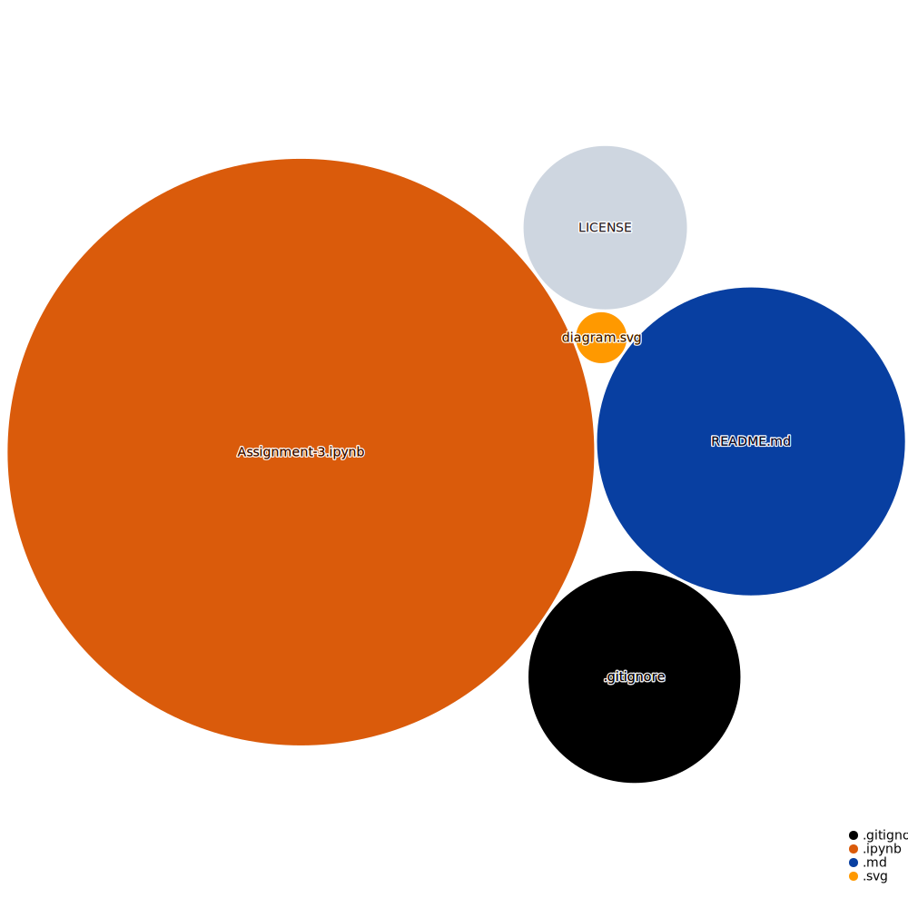

## Python Exercises
---
### **Description**:
This repository contains the 3° assignment of the Simulation Processes course in [ITESO](https://www.topuniversities.com/universities/iteso-universidad-jesuita-de-guadalajara) Bachelor of Financial Engineering.
It has 6 exercises in which lists comprehensions, dictionaries, functions, nested loops, conditionals and other python tools are used to solve the problems.

#### **Repository Tools:**

 <b>Click to expand</b> 

##### Github Action: 
##### Main Text-Editor:&nbsp; 
##### Language: 
##### Libraries:
##### Web-Interface:&nbsp;&nbsp; 
##### Version Control:&nbsp;&nbsp; 
 
##### License:&nbsp;

 <b>Work Contact:</b> 
 

     

 
  

 

##### **Diagram:**

---

### **References:** 
[`List Comprehensions`](https://docs.python.org/3/howto/functional.html)